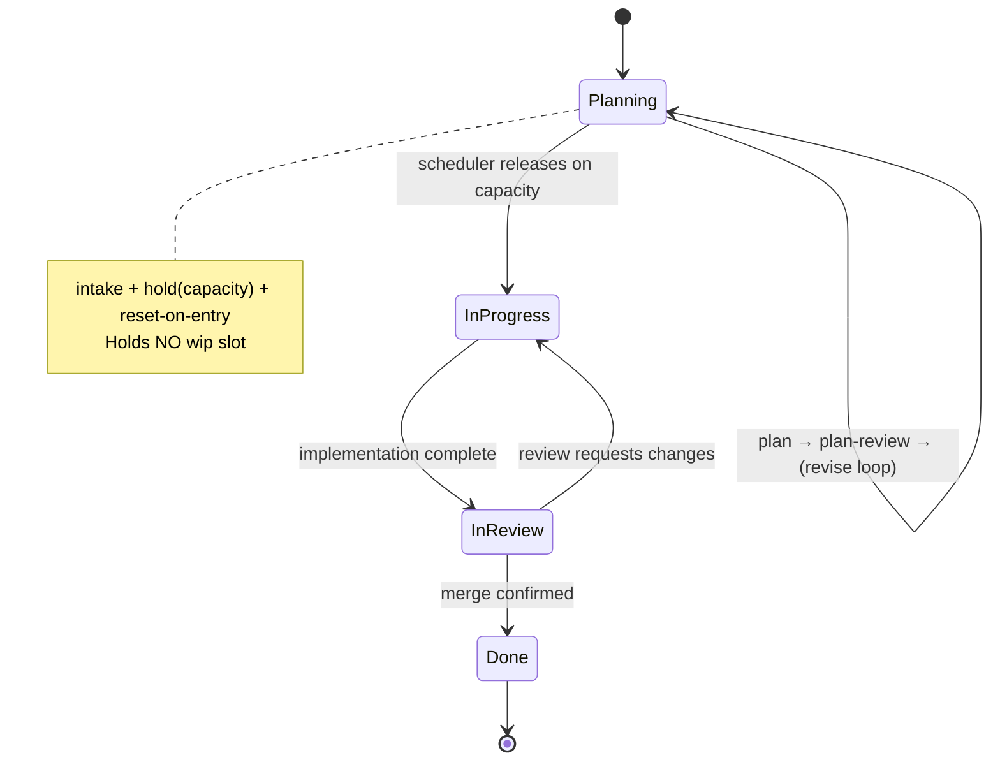
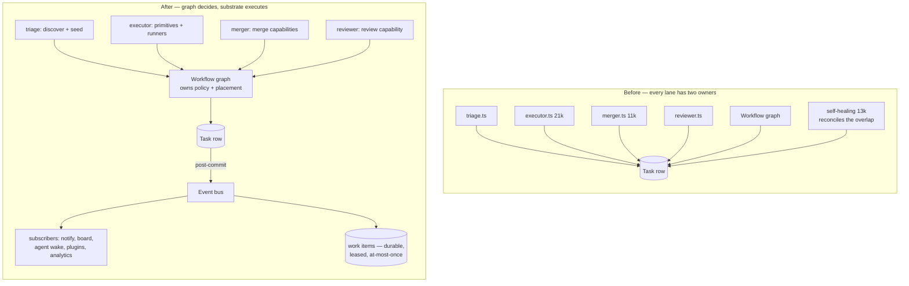
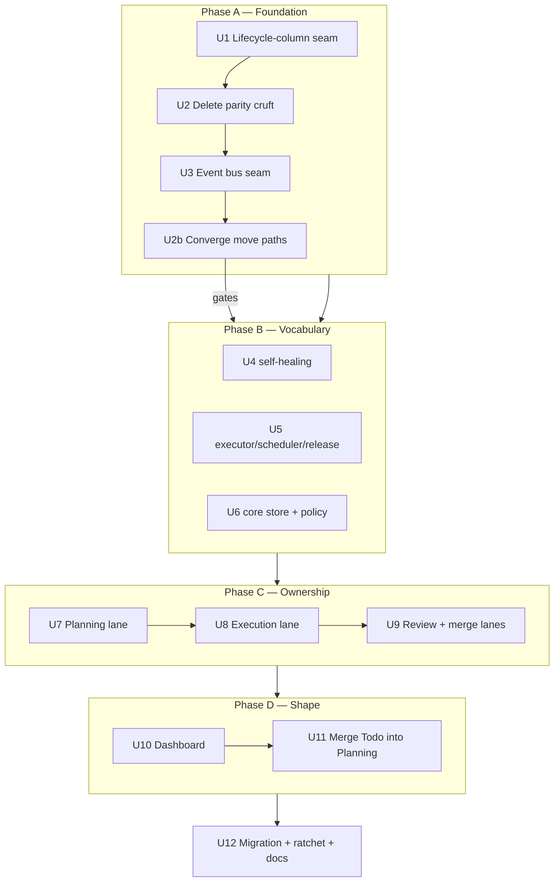

# Workflow-Owned Lifecycle — Graph Drives, Events React, Legacy Gone

## Goal Capsule

Make the workflow graph the single authority over the task lifecycle, and reduce the engine to substrate.

Four things land together, in this order: the engine stops naming columns literally and resolves them from the workflow; every lane — planning, execution, review, merge — moves behind graph nodes; node transitions emit **post-commit events** that subscribers react to, replacing imperative cross-service calls; and only then does the column shape change, merging Todo into a single **Planning** column that intakes, specifies, plan-reviews, revises, and holds for capacity.

This is a program, not a PR. It is phased so every phase lands green on its own and no phase both converts ownership and changes the workflow shape.

**Stop implementation if** a change makes a lifecycle decision unreachable without a test proving it unreachable; moves a state transition out of its transaction; weakens `autoMerge:false`, pause/cancel, dependency, capacity, or merge-proof safeguards; or leaves a stored task row pointing at a column no workflow declares.

---

## Problem Frame

The workflow describes the lifecycle; the engine decides it. Wherever they disagree, the engine wins silently.

**Columns are decided by string literals, not by the workflow.** **535** production code lines reference a lifecycle column literal (comments excluded), measured per-file during Phase B. The `~207` figure below counts only the guard/write/dashboard categories from the original session measurement — the *full* literal surface is 2.5x that, which is why Phase B is sliced rather than run as one unit. A guard that stops matching does not fail — it disables a recovery path invisibly. Measured against a clean baseline this session:

| Category | Count | Failure mode when the column moves underneath it |
|---|---:|---|
| Guards (`column === "todo"` / `!== "todo"`) | 82 | Silently stop matching; recovery disables itself; suite stays green |
| Writes (`moveTask(id, "todo", …)`) | 43 | Move a card into a column no workflow declares |
| Dashboard literals | 59 | Phantom column, illegal move menus, cards rendered nowhere |
| Other reads / typing | ~23 | Mixed |

Per-file census taken during Phase B (code lines only), which is the number to plan slices against:

| Unit | Files | Sites |
|---|---|---:|
| U4 | `self-healing.ts` | 203 |
| U5 | `executor.ts` 171, `scheduler.ts` 55, `replan-target.ts` 20, `merger-ai.ts` 5, `hold-release.ts` 4, `mesh-lease-manager.ts` 4, `task-agent-sync.ts` 3 | 262 |
| U6 | `moves.ts` 34, `default-workflow-hooks.ts` 13, `board-config.ts` 9, `blocker-fanout.ts` 6, `task-priority.ts` 5, `dependency-blocked-todo-report.ts` 2, `stale-paused-todo.ts` 1 | 70 |
| | **Total** | **535** |

At even 40% true-guard density that is ~200 red-green cycles, each needing a test that fails before conversion. Phase B therefore lands as slices — B1 policy modules, B2 small movers, B3 self-healing (sub-split per sweep), B4 executor + scheduler — with `moves.ts` and `default-workflow-hooks.ts` held back behind the move-path convergence decision.

**Every lane has two owners.** Triage runs specification while the graph declares `plan`/`plan-review` nodes for the same work. The executor holds implementation, retry, completion, and merge-boundary policy in imperative branches while the graph declares nodes for those seams. The merger owns merge policy, retry, and recovery routing that the IR also expresses. This dual ownership is what produced the FN-8504 race (a store-open sweep clearing a live planner's status), the done-laundering incident, and the compensating sweeps written to paper over both.

**Cross-service reactions are hardcoded calls.** When a task transitions, the code that must react — notify, wake an agent, refresh a board, enqueue follow-on work — is invoked directly from the transition site. That is why `executor.ts` is 21k lines: it is the junction box every lane routes through.

**Todo is a stage with no decision.** Readiness is the plan-review result plus the graph's capacity boundary; the column adds nothing. It survives only because 82 guards name it.

Scale of the surface being consolidated:

| Module | Lines | Owns today |
|---|---:|---|
| `packages/engine/src/executor.ts` | 21,085 | implementation, retry, completion, merge boundary, resume, handoff |
| `packages/engine/src/merger.ts` | 11,273 | merge policy, retry, recovery routing, git flow |
| `packages/engine/src/self-healing.ts` | 13,657 | reconciliation for all of the above |
| `packages/engine/src/triage.ts` | 4,299 | specification lifecycle |
| `packages/engine/src/reviewer.ts` | 1,228 | review invocation |

---

## Requirements

- **R1.** The coding workflows declare one pre-implementation column, **Planning**, carrying intake + capacity hold. Todo is not a lifecycle stage in any built-in coding workflow.
- **R2.** Specification, Plan Review, and the replan/revise loop run while the card is persisted in Planning. The card crosses into In progress exactly once, when the scheduler releases it against capacity.
- **R3.** Engine and dashboard resolve lifecycle columns from the task's workflow (traits), never from a hardcoded id. A workflow that renames or omits a column behaves correctly with no code change.
- **R4.** The graph owns every lane — planning, execution, review, merge. Lane services keep substrate responsibilities only: storage, leases, timers, process supervision, capacity, routing, recovery, audit.
- **R5.** A node transition emits an event **after** its transition commits. Subscribers react; no subscriber performs the transition. Durable follow-on work is written as a work item **inside the transition transaction** (transactional outbox), never left to a post-commit listener that a crash can skip. Work-item delivery is at-least-once, so every durable handler is idempotent.
- **R6.** Lifecycle state transitions remain transactional and single-writer. Capacity reservation, the move, and its guards commit together or not at all.
- **R7.** A task row in a column its workflow no longer declares is re-homed to that workflow's hold/intake column on startup, with an ids-only audit event. *(Shipped: `reconcileUndeclaredTaskColumns`.)*
- **R8.** Board, list, and move menus render each card's own workflow columns. No surface derives its column set from the legacy enum.
- **R9.** Machinery whose only purpose was the pre-cutover parity contract is deleted, not updated: the permanently-`true` `workflowColumns` flag and its branches, the legacy transition-parity harness, and the flag-off inline move path.
- **R10.** Coding (Ideas) keeps two pre-implementation columns — Ideas (manual capture, no AI) and Planning (spec + review + hold).
- **R11.** `todo` remains a legal column id for stored rows and user-authored or legacy workflows.
- **R12.** Every lifecycle decision that changes is covered by a test that fails when the decision stops being reachable — not merely by a green suite.

---

## Key Technical Decisions

**KTD-1. Planning carries `intake` + `hold(capacity)` + `reset-on-entry`.**
An intake-only column has no releaser — the capacity sweep only releases from a `hold` column, so a card in an intake-only Planning waits for a human forever. Proven this session: the `triage`-only placement stranded cards; the hold-column placement did not.

**KTD-2. Column vocabulary resolves through one per-task lifecycle-column seam.**
Most of the 207 sites have no workflow IR in scope, which is why this is plumbing, not find-and-replace. One resolver returns a task's lifecycle columns with a per-workflow cache; the existing trait helpers are its primitives.

**KTD-3. Events are post-commit reactions, never the transition — and durable follow-on work is enqueued IN the transaction.**
*(Session-settled with the operator, chosen over event-sourced lifecycle.)* The transition commits transactionally — capacity reservation, guards, and the move together — and the event fires after. Subscribers react; none of them perform the move. Event-sourced lifecycle would make capacity and move atomicity eventually-consistent, which is precisely the double-release and crash-stranding class this program exists to remove.

**Transactional outbox, not subscriber-enqueued work.** *(PR #2463 review — greptile P1.)* "Emit after commit, let a subscriber enqueue the durable work" has a crash window: a process that dies between the commit and the subscriber leaves no event and no work-item record, so required follow-on work is skipped permanently with nothing to recover from. The existing completion handoff already avoids this by creating its work item **inside** the move transaction. Follow the same pattern: any durable follow-on work is written as a work item in the same transaction as the transition, and the post-commit event carries only the reactions that are safe to lose (notify, board refresh, analytics). A dropped event must cost a notification, never a state change or a unit of work.

**Delivery is at-least-once; handlers must be idempotent.** *(PR #2463 review — greptile P2.)* `listDueWorkflowWorkItems` returns items whose lease has expired (`leaseExpiresAt IS NULL OR <= now`), so a worker that performs an external side effect and dies before recording completion will have that item re-claimed and re-run. Calling this substrate "at-most-once" would invite subscribers to skip the deduplication the delivery semantics actually require. Every durable handler is written idempotent, keyed on a payload-identifying invariant.

The durable substrate already exists (`workflow_work_items` with leases and states); the bus adds an emit point and a subscriber registry, not a second queue.

**KTD-4. Lane services become substrate; the graph owns policy.**
Triage discovers and seeds; the executor supplies primitives and node runners; the reviewer and merger expose capabilities. Node behavior moves to runners, policy moves to the IR. The vocabulary for this already exists in `CONCEPTS.md` — Workflow Runtime Primitive, Node Runner, Workflow Service — so this is completing a stated architecture, not inventing one.

**KTD-5. Adopt the existing workflow-owned merge design; do not redesign it.**
`docs/plans/2026-06-09-003-refactor-workflow-owned-merge-full-migration-slices-plan.md` (status `active`) already specifies the merge lane's target state and slices it S02–S08 in `docs/plans/workflow-owned-merge-stack/`. **Their statuses were corrected 2026-07-28** after a U9 pre-flight audit: S04 has LANDED, S02/S03/S05 are implemented but have zero production callers, and only S06–S08 are genuinely not started. Its target state ("workflow IR/runtime owns merge policy, retry policy, scheduling policy, recovery routing, and git operation flow; the engine keeps substrate") is exactly this program's R4 for the merge lane. U9 sequences and lands those slices rather than authoring a parallel design.

**KTD-6. Delete the parity machinery rather than update it — but only what is provably dead.**
`isWorkflowColumnsEnabled` returns a literal `true` with 8 live branches reading it. `workflow-parity.ts` asserts the default workflow's adjacency equals the legacy `VALID_TRANSITIONS`; once the default deliberately diverges, that assertion is not stale — it is wrong, and updating it would re-encode the shape we chose to break. Both are safe deletions.

> **CORRECTION (2026-07-27, Phase A escalation).** This KTD originally listed a third deletion — the "flag-off inline move path" in `packages/core/src/task-store/moves.ts` — on the claim that `default-workflow-hooks.ts` had superseded it. **That is backwards.** The inline branch is gated on `isWorkflowColumnsCompatibilityFlagEnabled` (`store.ts:38`), which reads the RAW `experimentalFeatures.workflowColumns` key — a *different* function from the always-true public helper. No production code writes that key, so the flag reads false and **the inline branch is the live move path for essentially every project, while `default-workflow-hooks.ts` is the dead one.** `moves.ts:637` states this outright. Deleting the inline branch would have swapped every project onto an untravelled code path and called it a cleanup.
>
> Two consequences bind the rest of this program:
> - The convergence is its own unit with an equivalence proof (**U2b**), and it **blocks Phase B**. Nothing downstream may assume the trait-hook path runs until it lands.
> - **U3's event emit point must attach to the LIVE inline path.** Wiring it into `default-workflow-hooks.ts` would produce a seam that never fires, and — because subscribers are non-authoritative by design — nothing would fail a test.
>
> The delete-only Execution note is what caught this: the unit required stopping on any behavior change rather than resolving it. Keep that note on every deletion unit.

**KTD-7. The IR change lands LAST.**
The instinct is to change the workflow first — ten lines, gate goes green. That was measured this session: the merge gate passed with 82 guards no longer matching. Conversion first, ownership second, shape last.

**KTD-8. `todo` the string survives; Todo the stage does not.**
`ColumnId` is already `Column | (string & {})`, so stored rows and custom workflows are unaffected by removing it from the built-ins. Purging it would invalidate historical rows and any user workflow declaring it, for no benefit.

---

## High-Level Technical Design

### Target lifecycle



### Ownership: before and after



### The transition contract

Directional guidance, not implementation specification:

```
node outcome
  └─> transition( task, targetColumn ):
        BEGIN TX
          guards + capacity reservation + move        ← atomic, single-writer
        COMMIT
        └─> emit TaskTransitioned{ taskId, from, to, nodeId, outcome, runId }

node outcome
  └─> transition( task, targetColumn ):
        BEGIN TX
          guards + capacity reservation + move                ← atomic, single-writer
          enqueue durable follow-on work items                ← transactional outbox
        COMMIT
        └─> emit TaskTransitioned{ ... }                      ← losable reactions only

subscribers (post-commit, non-authoritative):
  notify · board refresh · agent wake · plugin hooks · analytics

INVARIANTS:
  no subscriber performs a lifecycle transition
  no subscriber is the only record of durable work  (outbox owns that)
  a dropped event costs a reaction, never a state change or a unit of work
  work-item delivery is AT-LEAST-ONCE — handlers are idempotent
```

### Phasing



---

## Implementation Units

### Phase A — Foundation

### U1. Lifecycle-column resolution seam

**Goal:** One trait-driven resolver giving any call site its task's lifecycle column ids, so conversion becomes mechanical.

**Requirements:** R3 · **Dependencies:** none

**Files:** `packages/core/src/workflow-lifecycle-traits.ts`, `packages/core/src/__tests__/workflow-lifecycle-traits.test.ts`, `packages/core/src/index.ts`, `packages/core/src/index.gate.ts`

**Approach:** Add `resolveLifecycleColumns(ir)` returning `{ intake, hold, wip, review, complete, archived }` (first column carrying each trait; `undefined` when absent), plus a store-aware `resolveTaskLifecycleColumns(store, taskId, cache?)` over the existing `resolveWorkflowIrForTask`. Cache is a caller-owned map so a sweep resolves once per workflow. Unresolvable workflow returns `undefined` — callers keep conservative behavior rather than guessing.

**Patterns to follow:** `resolveReboundTarget` in the same file; the `irCache` map in the self-healing periodic sweep.

**Test scenarios:**
- Default coding IR resolves hold → `todo`, wip → `in-progress`, review → `in-review`, complete → `done`.
- Coding (Ideas) resolves intake → `ideas`, hold → `todo` — proving id-independence.
- A renamed-column workflow (`backlog`/`drafting`/`editorial-review`) resolves by trait.
- A workflow with no hold column returns `hold: undefined` without falling back to an unrelated column.
- A v1/column-less IR returns `undefined` rather than throwing.
- Two tasks on one workflow with a shared cache resolve the IR once (assert resolver call count).

**Verification:** Helper exported and unit-covered; no behavior change.

---

### U2. Delete the pre-cutover parity machinery

**Goal:** Remove the dead flag, legacy-parity harness, and unreachable flag-off move path so column literals have no legacy contract keeping them alive.

**Requirements:** R9 · **Dependencies:** U1

**Files:** `packages/core/src/workflow-columns-settings.ts` (delete), `packages/core/src/workflow-parity.ts` (delete), `packages/core/src/index.ts`, `packages/core/src/index.gate.ts`, `packages/engine/src/self-healing.ts`, `packages/engine/src/scheduler.ts`, `packages/engine/src/merge-trait.ts`, `packages/dashboard/src/routes/board-workflows.ts`, `packages/dashboard/src/routes/register-task-workflow-routes.ts`, `packages/core/src/store.ts`, `packages/engine/src/__tests__/legacy-tombstones.test.ts`

**Approach:** `isWorkflowColumnsEnabled` returns a literal `true` — every `if (!flag)` branch is unreachable, every `if (flag)` branch unconditional. Delete the function, inline the surviving side. Delete `workflow-parity.ts` (U11 deliberately breaks the equality it asserts). Extend the tombstone ratchet.

**Scope correction (2026-07-27):** the third deletion this unit originally carried — the flag-off inline move path — is NOT dead; it is the live path. See KTD-6's correction. It moves to **U2b** and must not be touched here. `moves.ts` is out of scope for this unit entirely.

**Execution note:** Delete-only. Any behavior change found while removing a branch means the branch was **not** dead — stop and treat it as a finding.

**Test scenarios:**
- Tombstone test fails if either deleted module reappears in source.
- Move side effects (timing accounting, reopen resets, in-review merge handoff, abort-on-exit) unchanged — assert via existing move-hook tests with no expectation edits.
- Merge-trait path behaves identically with the flag branch removed.
- Board-workflow route responses byte-identical for a default-workflow project.

**Verification:** Modules gone, ratchet covers them, `pnpm test:gate` and move-hook suites green with no expectation edits.

---

### U2b. Converge the two move paths (blocks Phase B)

**Goal:** One authoritative move-side-effect implementation, chosen deliberately and proven equivalent — not deleted on an assumption.

**Requirements:** R6, R9, R12 · **Dependencies:** U2, **U3**

**Files:** `packages/core/src/task-store/moves.ts`, `packages/core/src/default-workflow-hooks.ts`, `packages/core/src/store.ts` (`isWorkflowColumnsCompatibilityFlagEnabled`), `packages/core/src/__tests__/moves.test.ts`, `packages/core/src/__tests__/default-workflow-hooks.test.ts`

**Ordering with U3.** *(PR #2466 review — greptile P1.)* U3 attaches the event emit point to the LIVE inline path, and this unit replaces or deletes one of the two implementations — so a naive convergence would silently carry the emit point away with it, leaving no transition events and nothing failing. U3 therefore lands FIRST and this unit inherits a hard obligation: **the emit point survives convergence, on the surviving path, emitting the same events in the same order.** That is a named test scenario below, not a review checkbox.

**Approach:** Two implementations of the same side effects coexist: the inline branch in `moves.ts` (LIVE — the compat flag reads false because nothing writes it) and the trait hooks in `default-workflow-hooks.ts` (DEAD in practice). Characterize the live path first, prove equivalence behavior by behavior, then make one authoritative and delete the other along with the compat flag.

Behaviors to pin before anything moves: timing / `cumulativeActiveMs` accounting; reopen field and step resets; in-review auto-merge handoff preparation and merge-queue enqueue; abort-on-exit including `userPaused` for user-source moves only; the legacy bare-`Error` contract for legacy columns; and workflow-adjacency resolution for a non-legacy source column (FN-7591, and the Coding (Ideas) `ideas` column that `VALID_TRANSITIONS` cannot key).

**Execution note:** Characterization-first, and equivalence is a *proof obligation*, not a code review. If any behavior cannot be shown equivalent, stop and escalate with the specific divergence — do not reconcile it silently. This is the unit where "the tests pass" is least trustworthy, because both paths have tests and only one of them runs.

**Exercising both paths.** *(PR #2466 review.)* Only one implementation runs in production, so equivalence cannot be observed by running the suite normally. Tests must force each path explicitly: drive the inline branch with the compatibility flag absent (production shape) and the hooks path with `experimentalFeatures.workflowColumns: true`, through a single shared fixture so both run the same behavior cases. If forcing the flag is not sufficient to reach both implementations, add a test-only selector rather than asserting equivalence from reading the code.

**Test scenarios:**
- Each characterized behavior produces identical observable results on **both** paths — same fixture, flag forced each way — not merely on whichever path the suite happens to take.
- The U3 emit point still fires after convergence: same events, same order, same payloads, on the surviving path.
- A legacy-column rejection still throws the legacy bare `Error`, not `TransitionRejectionError`.
- A move out of a non-legacy source column resolves targets from the task's own workflow adjacency and is permitted.
- `userPaused` is cleared on a user-source move and preserved on an engine-source move.
- In-review entry prepares auto-merge handoff and enqueues the merge queue exactly once.
- After convergence, the compat flag is gone and no code path branches on it.

**Verification:** One move implementation remains; the equivalence evidence is recorded per behavior in the PR; `pnpm test:gate` green.

---

### U3. Post-commit event seam

**Goal:** One place transitions are announced, one registry of subscribers — the seam every later unit moves imperative reactions behind.

**Requirements:** R5, R6 · **Dependencies:** U2

**Files:** `packages/core/src/task-store/moves.ts`, `packages/core/src/workflow-events.ts` (new), `packages/core/src/types/workflow-events.ts` (new), `packages/engine/src/workflow-column-boundary.ts`, `packages/engine/src/workflow-event-subscribers.ts` (new), `packages/core/src/__tests__/workflow-events.test.ts` (new)

**Approach:** Define a typed lifecycle event (`TaskTransitioned`, `NodeEntered`, `NodeCompleted`, `RunSuspended`, `RunResumed`) carrying ids/outcomes only — same discipline as run-audit, no prose, no payload bodies. Emit **after** the transition transaction commits, from the single commit path in `moves.ts` and the boundary controller. Subscribers register through one registry; a subscriber throwing is logged and isolated, never able to fail or roll back the transition.

Durable follow-on work uses the **transactional outbox**: the work item is written inside the transition transaction (the shape `recordCompletionHandoff` already uses), so a crash between commit and emit loses at most a notification. Post-commit subscribers carry only losable reactions.

The existing `store.on/off` seam (triage's column-wake handler) becomes the first subscriber rather than a parallel mechanism.

**Execution note:** Test-first for the isolation and ordering invariants — they are the properties everything downstream will assume.

**Patterns to follow:** run-audit's ids/counts/outcomes-only metadata rule; `workflow_work_items` lease/claim semantics for durable follow-on work.

**Test scenarios:**
- An event is emitted only after the transition commits — a rolled-back transition emits nothing.
- A throwing subscriber does not roll back the transition and does not prevent other subscribers running.
- Event payloads carry ids/outcomes only; a payload with prose or a body fails the shape assertion.
- Ordering: two transitions on one task emit in commit order.
- Durable follow-on work survives a crash between commit and emit: kill after the transaction, and the work item is present and claimable on restart.
- A work item whose lease expires mid-flight is re-claimable, and its handler is idempotent — running it twice produces one effect.
- Dropping every subscriber leaves lifecycle behavior unchanged (proves reactions are non-authoritative).
- A crash between commit and emit leaves the transition durable and recoverable by the existing sweeps.

**Verification:** New seam is covered; no existing lifecycle behavior changes; the ids-only assertion is enforced by test, not convention.

---

### Phase B — Vocabulary conversion

### U4. Convert self-healing to resolved columns

**Goal:** The largest literal cluster (52 sites) reads columns from the workflow.

**Requirements:** R3, R12 · **Dependencies:** U1, U2

**Files:** `packages/engine/src/self-healing.ts`, `packages/engine/src/plan-review-continuation.ts`, `packages/engine/src/__tests__/self-healing.test.ts`, `packages/engine/src/__tests__/self-healing-trait-rekey.test.ts`, `packages/engine/src/__tests__/self-healing-completion-fanout.test.ts`

**Approach:** Convert per sweep with one cache per pass. Hold-column-gated sweeps take `columns.hold`; `?? "todo"` fallbacks become an explicit skip-and-log when the workflow cannot be resolved.

**Execution note:** For each converted guard, add or extend a test that fails when the guard stops matching **before** converting it. Green-after-conversion proves nothing here — this is the unit where a silently-dead guard is most likely.

**Test scenarios:**
- Each hold-gated sweep fires for a default-workflow card **and** a renamed-hold-column card; does not fire for a non-hold column in either.
- A task whose workflow cannot be resolved is skipped, not defaulted into a rebound.
- Rebound targets land in the workflow's own hold column for default, Ideas, and renamed workflows.
- Each workflow IR resolves once per sweep pass regardless of task count.
- `autoMerge:false`, user-paused, and live-session suppression unchanged.

**Verification:** Self-healing suites green including the renamed-workflow cases; no sweep regresses to a literal.

---

### U5. Convert executor, scheduler, and release paths

**Goal:** Dispatch, requeue, and release decisions read the workflow's columns.

**Requirements:** R3, R12 · **Dependencies:** U1, U2

**Files:** `packages/engine/src/executor.ts`, `packages/engine/src/scheduler.ts`, `packages/engine/src/hold-release.ts`, `packages/engine/src/replan-target.ts`, `packages/engine/src/mesh-lease-manager.ts`, `packages/engine/src/task-agent-sync.ts`, `packages/engine/src/merger-ai.ts`, plus `executor-graph-requeue-gate`, `scheduler-workflow-cutover`, `pre-release-plan-review`, `executor-stuck-requeue-preserve-progress` tests

**Approach:** Requeue/resume branches become hold-column comparisons; the `?? "todo"` rebound fallback becomes an explicit unresolvable path. `replan-target.ts` keeps its per-workflow resolution but loses its literal final fallback and the commentary the resolver makes obsolete.

**Test scenarios:**
- Graph failure with incomplete steps requeues to the workflow's hold column for default, Ideas, and renamed workflows.
- Release readiness holds and releases identically for a renamed hold column.
- The plan-in-place pre-release gate still requires plan-review evidence when the review node shares the card's column, and not when it does not.
- A replan rebound lands in the workflow's planning column; a workflow declaring neither legacy column is skipped with a log rather than moved arbitrarily.
- Resume-after-restart enters the recorded node, not a literal-column branch.
- Capacity, dependency, and overlap gates unchanged.

**Verification:** Executor/scheduler suites and `pnpm test:gate` green; no `"todo"` literal outside comments in converted files.

---

### U6. Convert core store and policy modules

**Goal:** Move validation, priority, blocker fan-out, and board config stop encoding the legacy column set.

**Requirements:** R3, R11 · **Dependencies:** U1, U2

**Files:** `packages/core/src/task-store/moves.ts`, `packages/core/src/task-priority.ts`, `packages/core/src/blocker-fanout.ts`, `packages/core/src/stale-paused-todo.ts`, `packages/core/src/dependency-blocked-todo-report.ts`, `packages/core/src/types/board-config.ts`, `packages/core/src/default-workflow-hooks.ts`, plus affected module tests

**Approach:** `ACTIVE_COLUMNS` / `UNBLOCK_ACTIVE_COLUMNS` become "not complete, not archived" resolved from the IR. `moves.ts` drops its remaining literal special cases. `COLUMNS` and the `Column` union stay exported for legacy rows and custom workflows (KTD-8) but stop being a behavioral source.

**Test scenarios:**
- Priority unblocking and blocker fan-out include a renamed workflow's active columns, exclude its complete/archived ones.
- A move into a column declared only by the task's own workflow is allowed; one the workflow does not declare is rejected with the existing rejection type.
- Reports keyed on the hold column produce identical rows for the default workflow before and after.
- A task on a workflow declaring `todo` is unaffected (R11).

**Verification:** Core suites green; the legacy union remains exported and typed for stored rows.

---

### Phase C — Ownership consolidation

### U7. The graph owns planning

**Goal:** Remove the parallel planning lifecycle — the graph runs specification; triage discovers, seeds, and recovers.

**Requirements:** R4, R5, R12 · **Dependencies:** U3, U4, U5, U6

**Files:** `packages/engine/src/triage.ts`, `packages/engine/src/workflow-planning-service.ts`, `packages/engine/src/workflow-node-handlers.ts`, `packages/engine/src/plan-review-continuation.ts`, `packages/engine/src/runtimes/in-process-runtime.ts`, plus `triage`, `plan-review-single-owner`, `pre-release-plan-review` tests

**Approach:** Triage keeps discovery, admission (semaphore, dedupe, pause), and crash recovery of its own dispatch. It stops *running* specification: the planning session moves behind the graph's `plan` node via the existing planning-service primitive. Planning lifecycle state gets exactly one writer — the graph — with triage reading it. Triage's post-specification reactions become event subscribers (U3), not direct calls.

FN-8504 is the acceptance case: a store-open sweep cleared a live planner's status because two owners wrote it. After this unit that race is structurally impossible, not guarded.

**Execution note:** Characterization-first. Capture the current planning lifecycle (statuses written, order, audit events) as tests before moving ownership.

**Test scenarios:**
- A newly promoted card is specified once: one planning session, one `PROMPT.md` write, one set of status writes.
- Concurrent triage poll + continuation drain for one card produce one planning run.
- A store-open reconcile racing a live planner does not clear its status (FN-8504 regression).
- Plan Review REVISE routes through the graph's replan edge and returns to review without triage re-specifying in parallel.
- A crashed planning session is recovered exactly once, by one owner.
- User pause during specification stops the run and is not resumed by the other lane.

**Verification:** Planning suites green; a grep-level assertion that planning status literals have one writer module.

---

### U8. The graph owns execution

**Goal:** `executor.ts` becomes substrate — primitives, node runners, and process supervision — with implementation, retry, completion, and merge-boundary *policy* expressed as graph nodes and IR config.

**Requirements:** R4, R5, R12 · **Dependencies:** U7

**Files:** `packages/engine/src/executor.ts`, `packages/engine/src/runtime-primitives.ts`, `packages/engine/src/workflow-node-handlers.ts`, `packages/engine/src/workflow-node-runner.ts`, `packages/engine/src/workflow-graph-executor.ts`, `packages/engine/src/workflow-event-subscribers.ts`, plus `executor-task-done-invariant`, `executor-graph-requeue-gate`, `executor-step-session`, `workflow-graph-optional-step-fix` tests

**Approach:** Work outward from the seams that already exist. Each imperative branch in `executor.ts` is classified as (a) node behavior → move to a runner, (b) policy → express as IR node config, (c) reaction → become an event subscriber, or (d) genuine substrate → keep (leases, semaphores, process supervision, worktree lifecycle, token accounting). Completion, retry/escalation, and the merge boundary are the highest-value branches: they are policy today and belong in the IR.

The measurable goal is that the executor stops deciding *what happens next* — the graph decides and the executor performs.

**Execution note:** Characterization-first, then move one branch class at a time. This unit is expected to land as several commits; it must not be attempted as one sweep.

**Patterns to follow:** `CONCEPTS.md` — Workflow Runtime Primitive, Node Runner, Workflow Service; the existing `runtime-primitives.ts` boundary is the target shape for everything moved.

**Test scenarios:**
- A completed task reaches review through a graph node outcome, not an executor branch — assert the graph's visited nodes, not a call spy.
- Retry/escalation budgets are read from IR config; changing the config changes behavior with no code change.
- The `fn_task_done` invariants (worktree, branch, commits-beyond-base) still refuse completion and still requeue via the resolved hold column.
- Honest-blocked exit (`outcome:"blocked"`) still parks failed with dependencies recorded and no review handoff.
- A dropped event subscriber changes no execution outcome (proves reactions are non-authoritative).
- Abort-on-exit, pause, and hard-cancel semantics are unchanged across the move.
- Session/worktree supervision remains in the engine and is unchanged.

**Verification:** Executor suites green; executor line count materially reduced with the removed logic present as nodes/runners/subscribers, not deleted behavior.

---

### U9. The graph owns review and merge

**Goal:** Review invocation and the merge lane become graph capabilities, landing the already-designed workflow-owned merge slices.

**Requirements:** R4, R5, R12 · **Dependencies:** U8

**Files:** `packages/engine/src/merger.ts`, `packages/engine/src/merger-ai.ts`, `packages/engine/src/reviewer.ts`, `packages/engine/src/merge-trait.ts`, `packages/engine/src/auto-merge-finalization.ts`, `packages/engine/src/pr-nodes.ts`, plus the merge/review test suites

**Approach:** Adopt `docs/plans/2026-06-09-003-refactor-workflow-owned-merge-full-migration-slices-plan.md` and its S02–S08 slices (`docs/plans/workflow-owned-merge-stack/`) rather than authoring a parallel design (KTD-5). **Re-measure before sequencing:** S04 landed and S02/S03/S05 are built-but-undriven, so U9's job on those is to WIRE them, not to build them — see `docs/workflow-policy-ownership-map.md` → "Measured Wiring State". Sequence them behind U8 so the merge lane converts onto an executor that is already substrate. The reviewer follows the same shape as the planning service: a capability the graph's review nodes call.

**S1 prerequisite — already landed.** *(PR #2463 review — greptile P1.)* S02 and S03 declare a direct dependency on S1 (workflow work-item schema + store API), and every later slice depends on it transitively. S1 is **in main**: the schema ships in `packages/core/src/postgres/migrations/0031_workflow_task_continuations.sql` and the store API (`listDueWorkflowWorkItems`, `acquireWorkflowWorkItemLease`, `transitionWorkflowWorkItem`, `replaceActiveTaskWorkflowContinuation`) is live and already drives the plan-review continuation path. Verify this at the start of U9 rather than assuming it — if any slice reaches for a store method that does not exist, land that gap as S1-completion work before continuing.

**Execution note:** Re-validate each slice against current `main` before landing — the stack was drafted 2026-06-09 and the graph has moved since (optional-groups, merge-attempt nodes, post-merge verification).

**Test scenarios:**
- Merge policy changes via IR config alone (retry counts, manual-hold behavior) with no code change.
- `autoMerge:false` remains terminal-until-human across the whole conversion; no recovery path promotes automatically.
- Merge proof gates (implementation proof, file-scope overlap, diff-volume) still block exactly as today.
- Branch-group member integration and promotion sequence unchanged.
- A transient merge failure retries through the graph's retry node, not a merger-internal loop.
- Review verdicts route as graph outcomes; a provider outage holds in place rather than fabricating a verdict.
- Post-merge verification still runs exactly once.

**Verification:** Merge and review suites green; merge policy demonstrably IR-driven via a config-only behavior test.

---

### Phase D — Surfaces and shape

### U10. Dashboard renders workflow-resolved columns

**Goal:** Board, list, menus, and task routes derive columns from each card's workflow.

**Requirements:** R8 · **Dependencies:** U4, U5, U6

**Files:** `packages/dashboard/app/components/Board.tsx`, `ListView.tsx`, `TaskContextMenu.tsx`, `TaskCard.tsx`, `TaskDetailModal.tsx`, `packages/dashboard/app/hooks/useBoardWorkflows.ts`, `packages/dashboard/src/routes/register-task-workflow-routes.ts`, plus their tests

**Approach:** `Board`, `ListView`, and `TaskContextMenu` import the legacy `COLUMNS`/`VALID_TRANSITIONS` directly — the reason a removed column would leave a phantom lane and offer illegal moves. Route them through the existing multi-lane workflow data so each lane renders its own columns and the move menu offers that workflow's adjacency. Server routes replace hardcoded retry/reset targets with the resolved rebound target. Board refresh becomes an event subscriber (U3).

**Test scenarios:**
- A board with cards on two workflows renders each lane's own columns; neither shows the other's.
- A card's move menu offers exactly its workflow's allowed targets and omits undeclared columns.
- A renamed hold column renders with the correct label.
- Retry/reset from a task route moves to the card's own workflow rebound target.
- Mobile and desktop breakpoints both render the resolved column set (Surface Enumeration — this is a UI affordance change).
- A card whose workflow has no matching column renders in the fallback lane rather than disappearing.

**Verification:** Dashboard suites green; no component imports the legacy `COLUMNS` for rendering decisions.

---

### U11. Merge Todo into Planning (IR change — last)

**Goal:** The coding workflows declare one pre-implementation column and place the specification phase in it.

**Requirements:** R1, R2, R10, R11 · **Dependencies:** U7, U8, U9, U10

**Files:** `packages/core/src/builtin-coding-workflow-ir.ts`, `builtin-stepwise-coding-workflow-ir.ts`, `builtin-stepwise-final-review-coding-workflow-ir.ts`, `builtin-workflows.ts`, `builtin-coding-ideas-workflow-ir.ts`, plus `builtin-workflows`, `builtin-workflows-lifecycle`, `benchmark-six-column-workflow`, `workflow-graph-entry-contract` tests

**Approach:** Planning (`triage`) gains `hold(capacity)` + `reset-on-entry` and keeps `intake`; `todo` leaves the coding IRs; `plan`, `plan-review`, `plan-replan` move to Planning. The stepwise IR's `wip` trait must declare `limitSetting: "maxConcurrent"` explicitly — the implicit "six columns matching the legacy enum" detection that supplied it no longer matches. Linear built-ins lose the "node after intake jumps to the hold column" exception, since Planning *is* the hold column. Ideas keeps its own two columns (R10) and its `todo`-id hold column (R11's in-tree compatibility case).

**Test scenarios:**
- Default Coding declares five columns; Planning's traits are exactly intake + hold + reset-on-entry.
- `plan`, `plan-review`, `plan-replan` resolve to Planning; `parse` is the first implementation-column node.
- Lifecycle drive: Planning → specify → plan-review → suspend at capacity → scheduler release → implement → review → merge, with the release attributed to the scheduler and one crossing into implementation.
- A failed `plan` parks in Planning, not in an implementation column.
- Entry contract: a card in Planning resumes at start; in In progress resumes at `parse`; in In review resumes at the first review node.
- Two Planning cards with `maxConcurrent: 1` release one at a time (proves the explicit `limitSetting`).
- Ideas still declares Ideas + Planning and drives end-to-end; a custom workflow declaring `todo` also drives end-to-end.

**Verification:** `pnpm test:gate` green; lifecycle drives green for default, Ideas, and a custom workflow.

---

### Phase E — Migration and ratchet

### U12. Migration, docs, and the anti-regression ratchet

**Goal:** Existing boards survive, and neither the literal vocabulary nor out-of-graph lifecycle logic can creep back.

**Requirements:** R7, R9, R12 · **Dependencies:** U11

**Files:** `packages/engine/src/self-healing.ts`, `packages/engine/src/__tests__/self-healing-undeclared-column.test.ts` (new), `packages/core/src/__tests__/no-hardcoded-lifecycle-columns.test.ts` (new), `packages/engine/src/__tests__/no-out-of-graph-lifecycle-writes.test.ts` (new), `AGENTS.md`, `CONCEPTS.md`, `docs/dashboard-guide.md`, `docs/solutions/architecture-patterns/workflow-node-column-placement-and-graph-entry-contract.md`, `.changeset/<name>.md`

**Approach:** Two source-scanning ratchets in the shape of the existing no-nested-components and no-blocking-shellout checks: one asserts no non-test module compares `task.column` against a literal lifecycle id; the other asserts lifecycle-state writes originate from graph node handlers or the transition seam, not from lane services. Both carry explicit allowlists for the built-in IR definitions and legacy-compat modules. `CONCEPTS.md`'s Task entry currently enumerates the six legacy columns and must describe workflow-defined columns instead.

**Test scenarios:**
- A card in a removed column is re-homed to its workflow's hold column on startup with one ids-only audit event.
- A user-paused card in a removed column is left alone; an unresolvable-workflow card is left alone and logged.
- Re-running the sweep is idempotent (no second move, no second audit row).
- Each ratchet fails on an injected violation and passes on the allowlisted files.

**Verification:** Ratchets green and provably failing on injected violations; changeset present and passing `pnpm check:changesets`.

---

## Scope Boundaries

**In scope:** column shape, lifecycle-column resolution, the post-commit event seam, graph ownership of planning/execution/review/merge, dead-flag and parity deletion, undeclared-column migration, dashboard column rendering, ratchets, docs, changeset.

### Deferred to Follow-Up Work
- Retiring `COLUMNS` / `Column` as exported types once no consumer needs the legacy union.
- Converting non-coding built-ins (marketing, lead-generation, pr-workflow) to a single pre-implementation column.
- Workflow-editor UX for expressing intake + hold on one column, and for editing merge policy now that it is IR config.
- Collapsing the compensating sweeps whose need disappears after Phase C — identify during implementation, remove with per-sweep evidence of unreachability.
- Event-sourced lifecycle (bus as authority). Explicitly rejected for this program by KTD-3; revisit only with durable ordered delivery and idempotent handlers.

### Non-Goals
- Changing merge *strategy* or `autoMerge` semantics — the merge lane changes owner, not behavior.
- Changing the default workflow selection for existing projects.
- Replacing planning or review prompts.
- Publishing a release (operator-only).

---

## Risks & Mitigations

| Risk | Mitigation |
|---|---|
| **A converted guard silently stops firing.** No test signal by construction. | Phase B requires a fires-for-renamed-workflow test per converted guard, written before conversion. U12's ratchet prevents reintroduction. |
| **Ordering temptation.** Doing U11 first makes everything "work" and hides dead guards. | KTD-7 and the phase graph put U11 in Phase D; its tests are the last commit. |
| **Program scale.** ~48k lines across the four lane services. | Phases land independently green; U8 explicitly lands as several commits; no phase both converts ownership and changes shape. |
| **Ownership moves break crash recovery.** Two owners currently cover each other's gaps. | U7/U8/U9 are characterization-first: capture current recovery behavior as tests before moving ownership. |
| **A "dead" branch turns out to be live.** Measured once already: the flag-off move path is the live one. | Every deletion unit keeps the delete-only Execution note — stop and escalate on any behavior change rather than resolving it. U2b converges the pair with an equivalence proof instead of a deletion. |
| **Event seam becomes a second source of truth.** The failure mode that motivated the program. | KTD-3 is enforced by test: dropping every subscriber must change no lifecycle outcome (U3, U8). |
| **The merge stack is stale.** Drafted 2026-06-09; the graph has moved. | U9 re-validates each slice against `main` before landing. |
| **Existing boards show cards in a vanished column.** | Shipped `reconcileUndeclaredTaskColumns`; U12 covers pause, unresolvable-workflow, and idempotency. |

---

## Open Questions (deferred to implementation)

- Whether the event payload needs a workflow-run correlation id beyond the existing `runId` — decide when the first subscriber outside the engine (dashboard refresh) is wired in U10.
- Exactly which compensating sweeps become unreachable after Phase C. Identify by test; removal is deferred follow-up, not this plan's scope.
- Whether `reset-on-entry` on Planning surprises operators who drag a card back from In progress. Watch during U11's lifecycle drives; the trait is separable from the merge if it does.
- How far U8's "policy → IR config" goes for retry/escalation budgets before it becomes over-configuration. Decide per branch during the unit, biased toward moving policy the operator can already see in settings.

---

## System-Wide Impact

- **Operators:** cards are visibly planned before occupying an implementation slot; one fewer column. Existing Todo cards move themselves to Planning on first startup after upgrade. Merge and retry policy become visible in the workflow rather than buried in engine code.
- **Custom workflow authors:** unaffected — ids stay free-form and trait-driven; a workflow declaring `todo` keeps working. Post-Phase C they gain real control over merge and retry policy.
- **Plugin authors:** the event seam is a supported extension point; reactions no longer require patching engine internals.
- **Concurrency accounting:** planning stops consuming a WIP slot, so effective implementation throughput at a given `maxConcurrent` rises. Operator-visible — flag it in the changeset.

---

## Sources & Research

- `docs/solutions/architecture-patterns/workflow-node-column-placement-and-graph-entry-contract.md` — the entry contract, the plan-in-place chain, and the measured failure table from three reverted attempts.
- `docs/plans/2026-07-21-001-fix-truthful-workflow-lifecycle-plan.md` — the five-column contract and suspend/resume protocol. Its R18 deferred "migrating `builtin:coding` node placement"; this plan is that deferred work.
- `docs/plans/2026-06-09-003-refactor-workflow-owned-merge-full-migration-slices-plan.md` (`status: active`) and `docs/plans/workflow-owned-merge-stack/` S02–S08 (statuses corrected 2026-07-28; see each slice's Measured State block) — the merge lane's existing target state and slices, adopted by U9 per KTD-5.
- `CONCEPTS.md` — Column, Column Trait, Hold, Slot, Workflow Runtime Primitive, Node Runner, Workflow Service. The Task entry enumerating the six legacy columns needs updating in U12.
- `STRATEGY.md` — the orchestration-layer approach; a workflow that actually drives the lifecycle is the product claim this program makes true.
- Session measurement (2026-07-26): 82 column guards, 43 column writes, 59 dashboard literals; `isWorkflowColumnsEnabled` returns a literal `true` with 8 live branches; `workflow-parity.ts` asserts equality with the legacy transition graph; lane service sizes as tabulated in Problem Frame.
